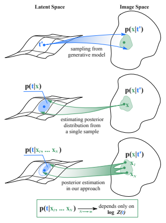

잠재 공간의 기하학적 지도를 그리기 위해 **피셔 정보 계량(Fisher information metric)**이라는 도구를 재구성하는 방법을 제안함.

피셔 정보(fisher information):
어떤 데이터가 특정 모수(parameter)에 대해 얼마나 많은 정보를 담고 있는지를 측정하는 척도임. 여기서 모수는 우리가 알고 싶어 하는 시스템의 숨겨진 특성값(동전의 앞면이 나올 확률, 정규분포의 평균)을 의미.

수학적으로 피셔 정보는 log-likelihood function의 2차 미분(헤세 행렬)에 대한 기댓값으로 정의됨. -> 로그 가능도 함수가 얼마나 '뾰족'한가?
- 뾰족한 함수(피셔 정보가 높음): 데이터로부터 모수를 추정했을 때, 그 추정값이 매우 정밀하다는 의미. 즉, 데이터가 모수에 대한 많은 정보를 담고 있어서 우리가 그 값을 확인할 수 있음.
- 완만한 함수(피셔 정보가 낮음): 추정된 모수 값의 신뢰도가 낮다는 의미. 데이터가 모수에 대한 적은 정보를 담고 있어서, 다른 값일 가능성도 충분히 열려 있음.
피셔 정보가 높음 -> 데이터가 모수에 대한 많은 정보를 담고 있음 -> 모수의 값을 더 정확하게 추정할 수 있음 -> 불확실성이 줄어듦.

Q. 헤세 행렬이란 hessian matrix인가?  
- 어떤 함수의 이차 미분을 행렬 형태로 표현한 것. 함수의 곡률(curvature)을 나타냄.
- 변수가 하나일 때(일차 미분, 경사): f'(x), 함수의 특정 지점에서 얼마나 가파른지를 알려줌.  
- 변수가 여러 개일 때(이차 미분, 곡률, Hessian matrix): f''(x), 그 지점에서 함수가 어떻게 휘어 있는지를 알려줌. 함수의 특정 지점에서 모든 방향으로 얼마나 가파른지를 알려줌. 이차함수의 경우에서 값이 양수이면 아래로 볼록, 음수이면 위로 볼록함.  
- 헤시안 행렬은 이것을 여러 변수를 가진 함수로 확장한 것. 입력 변수가 여러 개일 때, 각 지점에서 함수가 어떤 방향으로 얼마나 휘어 있는지를 알려줌. 즉, 다차원 공간에 있는 어떤 지형의 '곡률'을 설명하는 도구임. 이 논문에서는 잠재 공간이라는 다차원 지형의 곡률을 파악하기 위해 헤시안 행렬을 사용함.

Q. 2차 미분행렬(헤세 행렬) 이상은 사용하지 않는가?  
- 계산량이 기하급수적으로 늘어남. 1차미분: 기울기 또는 경사, 2차미분: 곡률(헤시안 행렬), 3차미분: 곡률의 변화율.  
- 대부분의 ML문제에서는 방향(1차), 곡률(2차)정보만으로도 충분히 최적화 가능.

Q. 데이터가 모수에 대한 정보를 담고 있다는게 무슨 뜻인가?  
- "데이터를 통해 모수의 정체를 더 정확하게 추측할 수 있게 된다."는 의미. 즉, 데이터가 우리의 불확실성을 줄여준다는 뜻.

Q. 모수 공간이 무엇인가?  
- 모수 공간이란 어떤 모델이나 시스템에서 모수가 가질 수 있는 모든 가능한 값들의 집합임. 이때 모수는 256개의 각 차원에 해당하는 잠재 벡터의 값들임.
- 현재 256차원의 잠재공간 = 모수 공간.  
- 더 정확히 말하면, 디코더의 입장에서의 모수 공간임. 디코더는 잠재 벡터를 입력으로 받아 이미지를 생성하는 역할을 하므로, 잠재 벡터의 모든 가능한 값들이 디코더의 모수 공간을 형성함.

Q. 모수 공간에 거리를 어떻게 정의하나?  
- 이 공간에서의 거리는 흔히 생각하는 물리적(유클리드)거리와는 다름. '두 모수값이 만들어내는 결과가 얼마나 구별 가능한가?'를 기준으로 정의됨. 이것이 피셔 정보 계량이 하는 역할임. 이처럼 모수 공간의 거리는 모수 값의 숫자 차이가 아니라 그 차이가 만들어내는 결과의 차이(정보량의 차이)로 정의됨.

Q. '모수 공간에서 민감한 방향으로 공간이 늘어나 있고, 둔감한 방향으로 압축된 형태의 휘어진 기하학적 구조를 가지게 됨.'말의 의미는 무엇인가?  
- 잠재공간 내에서 어떤 방향으로는 잠재 벡터 값을 수치적으로 많이 바꿔도(물리적 거리가 멀어도) 디코더를 통해 생성된 이미지에는 거의 변화가 없는 경우가 있음. 이때 이 방향으로의 잠재 공간은 압충되어 있다고 말할 수 있음.(피셔 정보 계량으로 잰 거리가 가깝기 때문임.)  
- 반대로, 어떤 방향으로는 잠재 벡터 값을 조금만 바꿔도(물리적 거리가 가까워도) 디코더를 통해 생성된 이미지가 크게 바뀌는 경우가 있음. 이때 이 방향으로의 잠재 공간은 늘어나 있다고 말할 수 있음.(피셔 정보 계량으로 잰 거리가 멀기 때문임.) 전에 얘기한 상전이 경계가 바로 이런 곳을 의미함.  
-  잠재 공간의 '거리'는 수치적 변화량이 아닌 **'결과의 변화량'**을 기준으로 측정됨.

Q. 생성된 샘플들을 보고 원래의 잠재 변수가 무엇이었을지 추측해 사후 분포(posterior distribution)를 근사한다는 의미가 무엇인가?  
>1. '생성된 샘플'을 본다.  
잠재 공간에서 임의의 잠재 벡터를 디코더로 보낸 후 생성된 샘플을 관찰. 이때 우리는 이 이미지를 만들어 낸 `z_true`가 무엇이었는지 전혀 모르는 상태임.  
>2. '원래의 잠재 변수'를 추측.  
"이 이미지는 '웃는 표정'이네. 그렇다면 256개 숫자 중 **'표정'을 담당하는 모수(축)**의 값은 양수일 가능성이 높겠군."  
"머리가 갈색인 것을 보니, '머리색'을 담당하는 모수는 특정 범위의 값을 가질 거야."  
"안경을 썼으니, '안경 유무'를 담당하는 모수는 1에 가까운 값이겠지."  
이렇게 이미지의 특징을 보고, 그것을 만들어냈을 법한 256개 숫자 조합을 추측.  
>3. 사후 분포 근사.  
사후 분포는 256차원 잠재 공간 전체에 뿌려진 확률 밀도 지도임. `z_true`가 있었을 것으로 가장 강력하게 추정되는 지역은 확률 밀도가 높게 나타나고, 가능성이 없는 지역은 낮게 나타남.  
예를 들어, '웃는 표정'과 관련된 축들의 값들은 높은 값을 가질 확률이 높게, '슬픈 표정'과 관련된 축들의 값은 낮은 값을 가질 확률이 높게 표시된 지도가 그려짐. '안경 유무'축의 값은 1에 가까운 영역에서 확률이 높게 나타날 것임.  
'근사'라는 것은 이 지도를 완벽히 그릴 수 없을 뿐더러 현재 상황에서는 잠재 공간 내 256차원을 완벽히 그리기 위한 재료(20,000개의 잠재 벡터)가 터무니없이 부족함. 하지만 논문에서처럼 여러 장의 이미지를 샘플링하여 그 공통점을 종합하면, 이 사후 분포는 점점 더 원래의 `z_true`주변으로 뾰족하게 모여들며 정답에 가까워짐.

  
figure 1. 생성 모델에서의 정방향 및 역방향 과정
>윗부분: 정방향 생성 과정(sampling from generative model)  
모델이 이미지를 만들기 위해 사용하는 잠재공간에서 특정 지점 t\`를 선택(이미지를 생성할 원인 또는 설계도)해 디코더를 통해 이미지 공간으로 보냄. 이때 p(x|t\`)는 t\`가 주어졌을 때 x라는 이미지가 나올 확률 분포를 의미.  
>중간 부분: 단일 샘플(x)로부터의 역추적(estimating posterior distribution from a single sample)  
위와 반대로, 생성된 이미지 x하나만 보고 이 이미지를 만들어냈을 '원인'이 무엇이었을지 역추적함. 하지만 단서가 x하나뿐이라 추측의 범위가 매우 넓고 불확실함. 그림에서 p(t\`|x)는 x가 주어졌을 때 t\`가 원인일 확률 분포를 의미.  
>아래 부분: 다중 샘플(x1, ..., x_N)을 이용한 역추적(posterior estimation in our approach)  
이번엔 t\`에서 생성된 여러개의 샘플들(x1, ..., x_N)을 확보. 이 여러 개의 샘플들을 종합하여 원래의 t\`가 무엇이었을지 추측함. 그림에서 p(t\`|x1, ..., x_N)단일 샘플때의 사후 분포p(t\`|x)보다 훨씬 더 좁고 뾰족한 추측이 가능해짐. 그림에서 p(t\`|x1, ..., x_N)는 여러개의 샘플들이 주어졌을 때 t\`가 원인일 확률 분포를 의미.

>이럼 일대다대응이 아니지않나? 점과 점의 대응이 아니라 점과 하나의 확률분포의 대응이니까 일대일대응이 맞음?(이건 검증 필요)

>이 것이 바로 사후 분포 근사임.  
하나의 잠재 변수에서 여러 샘플을 생성하고, 그것들을 단서로 삼아 원인이었던 잠재 변수의 위치를 정밀하게 추정(사후 분포 근사)하는 과정임.  
샘플 수가 무한대로 늘어났을 때(우연과 노이즈를 모두 제거하고 시스템의 순수한 본질(로그 분배 함수)만을 남기는 과정을 의미) 정밀하게 근사한 사후 분포는 결국 log Z(t)라는 **로그 분배 함수**에 의해 결정되고, 이 log Z(t)의 2차 미분이 바로 잠재 공간의 기하학적 구조를 나타내는 피셔 정보 계량임.  

Q. 잠재 공간 내 20,000개 잠재 벡터로 무수히 많은 이미지를 생성하면, 로그 분배 함수 log Z(t)를 얻을 수 있고, 이 로그 분배 함수의 2차 미분이 잠재 공간의 기하학적 정보를 담고 있다는 것. 근데 잠재 벡터 z 1개로 디코더를 통해 이미지를 만드는 과정을 100번 했을 때 그 100장의 이미지는 약간의 노이즈차이는 있겠지만 모두 같은 특징들을 담고 있을 것임. 그 100개가 잠재 공간 내 z주변의 convex한 곳에서 샘플링된다고 해보자. 그런 과정을 20,000개 잠재 벡터에 대해 무수히 한다고 기존에 잠재 공간 내 non-convex한 곳까지 우리가 바라볼 수 있을까?

>잠재 공간 내 convex한 점들(20,000개 잠재 벡터들) 주변에서만 샘플링한다면, 그 안정적인 지역의 특성만 알게 될 뿐, 그 사이 non-convex한 공간은 발견하기 어려운것은 사실임.
논문의 진짜 목표는 잠재 공간 내 지형도를 그리는 것이기에 점과 점 사이 경로(보간)를 탐색.  
>만약 z_A와 z_B 사이의 공간이 안정적이고 convex하다면, z_0.01부터 z_0.99까지 계산된 사후 분포의 모양은 서서히, 부드럽게 변할 것임.
하지만 만약 이 경로 중간에 non-convex한 상전이 경계(ex. '여성'에서 '남성'으로 바뀌는 지점)가 존재한다면, 그 경계를 지나는 순간 사후 분포의 모양이 급격하게 변하는 것이 관찰됨.  
>100개의 사후 분포를 각각 따로 보는 것이 아니라, 1번 지점부터 100번 지점까지 사후 분포가 '어떻게 변화하는가'의 연속적인 패턴을 관찰함.  
경로가 안정적일 때는 100개의 지점의 사후분포는 자연스럽게 변화함. 예를 들어 50번째 사후 분포는 49번째와 51번째 사후 분포 사이 비슷한 모양을 가지고 있을 것임.  
경로가 불안정할 때는 특정 지점의 사후분포가 갑자기 다른 곳에 다른 모양으로 튀어 오르는 현상이 관찰됨. 이때 이 지점이 바로 상전이 경계임.

Q. 각 지점에서 사후 분포의 변화를 어떻게 확인하지? 현재 20,000개의 잠재 벡터가 있는 공간은 256차원인데?  
>잠재 공간에 20000개의 벡터 중 두개 z_A, z_B를 선택해.  
두 점 사이에 100개의 보간 지점(z_1~z_100)을 나눈 뒤, 각 지점에서 샘플링해서 이미지공간(x_1,50~x_100,50 , 각 지점별로 50개씩 샘플링 했다고 가정.)으로 보내.  
그 이미지들(x_1,50~x_100,50)이 어디서(z_1~z_100) 나왔을지에 대한 확률 계산.  
각 지점(z_1~z_100)별 사후 분포의 중심점(평균 벡터, u_1~u_100)끼리 거리 계산(d_1~d_100)후 이 거리값을 그래프로 표현.  
이때 그래프가 일정한 변화율을 가지고 있으면 해당 경로는 안정적임.  
그래프에 튀는 형상이 있다면 그 지점이 상전이 경계임.  

Q. 사후 분포는 어떻게 계산하나?
>논문에서는 CLIP과 같은 사전학습된 피처 추출기를 사용을 제안함.

(여기부터 다시 보기)

---

이 사후 분포를 이용해 피셔 계량을 정의하는 **로그 분배 함수(log-partition function)** 를 학습함.

이징(Ising) 모델과 같은 실제 통계 물리 모델에 적용하여 검증되었으며, 기존 방식들보다 성능이 뛰어남

주요 발견: 프랙탈 구조와 상전이
이 분석 방법을 확산 모델에 적용했을 때 다음과 같은 중요한 사실들을 발견했습니다.

프랙탈 구조의 발견: 잠재 공간 내부에 상전이(phase transitions)의 프랙탈(fractal) 구조가 존재함을 밝혀냈습니다. 이는 이미지의 종류가 바뀌는 경계가 매우 복잡하고 민감하다는 것을 의미합니다.

보간의 실패 지점 규명: 잠재 공간의 같은 '상(phase)' 내부에서는 보간(interpolation)이 거의 선형적으로 부드럽게 작동하지만, 이 '상'의 경계를 넘을 때 선형성이 깨지고 급격한 변화가 발생함을 입증했습니다.

극도의 민감성: 이 상 경계에서 확산 모델은 **발산하는 립시츠 상수(divergent Lipschitz constant)**를 보이는데, 이는 잠재 벡터의 아주 작은 변화에도 이미지 결과물이 극도로 민감하게 반응한다는 뜻입니다.
