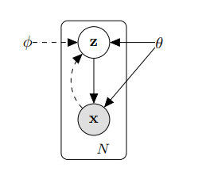

GAN 논문 내 VAE

Variational Autoencoder(VAE)
VAE는 인코더와 디코더 구조를 가짐.
인코더: 실제 데이터 x를 받아 저차원 잠재벡터 z에 대한 확률 분포(q(z|x))를 학습함.
디코더: 잠재 벡터 z를 샘플링하여 다시 x와 유사한 데이터로 복원함.

# Auto-Encoding Variational Bayes
>Diederik P. Kingma, Max Welling

## Abstract

다루기 힘든 사후 분포(intractable posterior distributions)을 가진 연속적인(continuous)한 잠재 변수(latent variable)가 존재하고 데이터셋이 큰 경우, 방향성 확률 모델에서 어떻게하면 효율적으로 추론(inference)와 학습(learning)을 수행할 수 있을지에 대한 당시 머신러닝의 중요하고 어려운 난제를 제시함.

>**방향성 확률 모델**(directed probabilistic models): 원인과 결과 관계 p(z) -> p(x|z)를 그래프로 나타내는 모델(directed graphical model)을 의미. 대표적으로 bayesian network가 있음.  
>**잠재 변수**(latent variable): 데이터 x를 생성하지만 직접 관찰할 수는 없는 변수임. 예를 들어 이미지(x)를 생성하는 '얼굴 표정'이나 '글씨 스타일'(z)같은 특징임.
>**사후 분포**(posterior distribution): 관찰된 데이터 x가 주어졌을 때, 이 데이터를 생성했을 잠재 변수 z의 분포 p(z|x)를 의미함.

저자는 대규모 데이터셋에 확장 가능하며, 약간의 미분 가능성 조건 하에서는 다루기 힘든 경우에도 작동하는 확률적 변분 추론 및 학습 알고리즘을 소개함.
>**변분 추론**(variational inference): intractable한 사후 분포 $p(z|x)$를 $q(z|x)$라는 다루기 쉬운 근사 분포(예: 가우시안)로 대체하여 추론하는 기법  
>**확률적**이라는 의미는 전체 데이터가 아닌 일부(미니 배치)를 무작위로 뽑아서 경사하강법으로 학습하는 것을 의미.(대용량 데이터셋에 적용 가능)

이 논문의 핵심 기여는 두가지가 있음.

첫번째로 변분 하한(variational lower bound, ELBO)의 재매개변수화(reparameterization)가 표준적인 확률적 경사 하강법(standard stochastic gradient methods)을 사용하여 간단하게 최적화될 수 있는 하한 추정치(lower bound estimator)를 산출한다는 것을 보여줌.
>**변분 하한**: $p(z|x)$를 $q(z|x)$로 근사할 때, 두 분포가 얼마나 다른지(KL-divergence)를 측정하는데, 이 과정에서 유도되는 목적 함수($\mathcal{L}(\theta,\phi;x^{(i)})$)임.  VAE는 이 ELBO를 최대화하도록 학습함. 이때 ELBO는 $q_\phi(z|x)$에 대한 기댓값($\mathbb{E}_{q_{\phi}(z|x)}[\dots]$)을 포함합니다. 13 이 기댓값을 계산하기 위해 $q_\phi$로부터 $z$를 샘플링($z \sim q_\phi(z|x)$)해야 하는데, '샘플링' 연산은 미분이 불가능함. 따라서 q의 파라미터 $\phi$로 gradient가 역전파될 수 없기에 $\phi$를 학습시킬 수 없었음.  
>**재매개변수화**: q에서 z를 샘플링($q_{\phi}(z|x)$) 대신 $z = g_\phi(\epsilon, x)$ (예: $z = \mu_\phi(x) + \sigma_\phi(x) \odot \epsilon$, 여기서 $\epsilon \sim \mathcal{N}(0, 1)$) 처럼 $z$를 $x$와 파라미터($\phi$)에 대한 결정론적 함수 $g_{\phi}$와 외부 노이즈 $\epsilon$의 결합으로 바꿈. 이로써 z를 샘플링하는 대신 $\epsilon$을 샘플링하여 z를 $\phi$에 대해 미분 가능한 함수로 표현할 수 있음. 따라서 전체 목적 함수를 $\phi$에 대해 미분 가능하여 SGD로 최적화하는 것이 가능해짐.

두번째로 데이터포인트마다 연속적인 잠재 변수를 갖는 i.i.d. 데이터셋에 대해, 제안된 하한 추정치를 사용하여 다르기 힘든 사후 분포에 근사 추론 모델(encoder, 인식모델이라고도 함)을 피팅함으로써 사후 추론이 특히 효율적으로 수행될 수 있음을 보여줌.
>**i.i.d.**(independent and identically distributed)**: 데이터가 서로 독립적이고 동일한 분포에서 샘플링되었다는 표준적인 통계 가정임. 전통적인 변분 추론은 각 데이터포인트 $x_i$마다 최적의 $z_i$를 찾기 위해 별도의 최적화 과정이 필요했음.  
>**근사 추론 모델**: VAE는 $q_\phi(z|x)$를 신경망(Encoder)으로 만듦. 이 신경망은 $x$를 입력받아 최적의 $q$ (예: $q$의 파라미터인 $\mu$와 $\sigma$)를 한 번의 계산(forward pass)으로 출력함. 이로써 개별 데이터마다 z를 최적화하는 대신 x를 z의 분포 파라미터로 매핑하는 추론 모델 자체를 학습시킴.이 모델의 파라미터 $\phi$는 모든 데이터에 대해 분담되어 공유됨. 따라서 학습이 끝난 후 새로운 x가 들어와도 즉시 z의 분포를 추론할 수 있어 효율적임.(인식모델은 x를 보고 z를 인식한다고 해서 붙여진 이름임.)

위 두가지 기여는 이후 실제 실험으로 보여짐.

> **Q.** intractable한 $p(z|x)$와 $q(z|x)$의 차이는 무엇인가? q(z|x)를 전개했을 때 q(x)를 포함하는 intractable한 분포가 아닌가?  
> **A.** 실제 사후 분포 p(z|x)는 베이즈 정리에 의해 p(x|z)p(z)/p(x)로 표현되는데, p(x)(확률 변수 x에 대한 marginal likelihood)를 계산하는 것이 intractable함. $p(x) = \int p(x|z)p(z)dz$ 꼴의 적분이기 때문임. z는 연속 변수이고 p(x|z)는 복잡한 신경망(Decoder)이기 때문에, 모든 z에 대해 이 적분을 계산하는 것이 수학적으로 불가능함. 따라서 p(x)를 모르기 때문에 p(z|x)의 정확한 확률 밀도 값을 계산할 수 없음.  
따라서 p(z|x)를 베이즈 정리를 통해 p(x)를 계산하는 것을 포기하고, 이를 근사하기 위해 $q_{\phi}(z|x)$를 함수(신경망)로 직접 정의함.

반면, q(z|x)는 우리가 선택한 근사 분포이므로 우리가 원하는 형태(예: 가우시안)로 정의할 수 있음. 따라서 q(z|x)는 다루기 쉬운 분포임.

## 1 Introduction

앞서 언급한 난제에 대해 사후분포를 정확하게 계산하는것이 불가능하기에 p(z|x)와 비슷한 q(z|x)를 효율적으로 찾는 것을 목표로 삼음.
변분 베이즈(Variational Bayes, VB) 접근 방식은 intractable한 사후 분포에 대한 근사치를 최적화하는 과정을 포함함. 하지만 일반적인 평균장(mean-field)접근 방식은 근사 사후 분포에 대한 기댓값의 해석적 해를 필요로 하는데, 이 역시 일반적인 경우에는 intractable함.
이 논문은 해석적 해를 포기하고 sampling을 통한 추정치(재매개변수화)를 사용함. 이 추정치가 편향되지 않다(unbiased)는 것은 추정치의 기댓값이 실제 하한값과 일치한다는 의미로 수학적으로 타당함을 보장함. 또, 이 추정치는 SGD로 최적화할 수 있을 만큼 간단해짐.

확률적 경사 변분 베이즈(Stochastic Gradient Variational Bayes, SGVB)추정치는 앞서 언급한 난제에 대해 효율적인 대안(재매개변수화, 근사 추론 모델)을 제공함.

>* **SGVB**: 재매개변수화 트릭을 사용하여 ELBO의 gradient를 계산하고 SGD로 최적화할 수 있게 만든 추정치.  
>* **AEVB**: SGVB 추정치를 사용하여 인식 모델(encoder)을 도입하여, 데이터마다 추론을 반복하는 대신 추론 자체를 학습하는 알고리즘.  
>* **VAE**: AEVB 알고리즘을 신경망으로 구현한 모델.

> **Q.** 해석적 해를 포기한다는 것은 어떤 의미인가?  
> **A.** 먼저 해석적 해란 복잡한 방정식을 풀기 위해 논리적, 대수적 방법을 사용하여 정확한 형태의 해를 구하는 것을 의미. VB는 q(z)가 p(z|x)와 가장 비슷해지는 최적의 q(z)를 찾기 위해, 복잡한 기댓값 적분을 손으로 풀어야 했음. 하지만 이 적분이 복잡한 신경망일 경우에는 기댓값 적분이 복잡해져서 해석적으로 푸는 것이 불가능함. VAE는 이 해석적 해를 포기하고, Monte Carlo 샘플링을 사용하여 기댓값을 수치적으로 근사함으로써 이 문제를 해결함. 즉, 샘플 몇개 뽑아서 계산한 평균값으로 기댓값을 근사한다는 의미고 이게 SGVB임.

> **Q.** 평균장(mean-field)접근 방식이란 무엇인가?  
> **A.** 평균장 이론(mean-field theory) 또는 자기 일관성 장 이론은 원래 모델의 자유도에 대해 평균화하여 근사하는 더 간단한 모델을 연구함을 의미함.[wikipedia] 이 개념은 본래 물리학(통계 역학)에서 유래했지만, 변분 베이즈 추론에서 intractable한 사후 분포를 근사하기 위한 핵심 전략으로 사용됨. 다시 이 문제로 넘어와 생각하면 복잡한 확률 분포를 다루기 위해 복잡한 상호작용을 모두 무시하고, 단순한 독립적인 부분들의 곱으로 분해하여 근사하려는 아이디어임. 다시 말해, 근사하려는 분포(q(z))의 모든 잠재 변수가 서로 통계적으로 독립이라고 가정하는 것임. 수식으로 유도하면 $q(z) = \prod q(z_i)$ 이렇게 표현됨. 수학적으로 이는 q(z)가 z의 개별 변수 $z_1, z_2...z_n$에 대한 분포의 곱으로 인수분해된다는 의미임. VAE 이전 전통적인 VB는 이 평균장 가정을 사용하여 해석적 해를 유도하려 했으나 복잡한 신경망에서는 불가능했음. 즉, 평균장 접근 방식은 q를 너무 단순하게 가정하는 것도 문제지만, 복잡한 모델(VAE의 decoder)에서는 해석적 해를 구하는 것 자체가 불가능하다는 문제가 있음.  
>3장에서 VAE의 $q_\phi(z|x)$를 대각 공분산(diagonal covariance)을 갖는 가우시안 $\mathcal{N}(\mu, \sigma^2I)$으로 가정하는데 공분산 행렬이 대각이라는 것은 모든 잠재 변수($z_i$, z의 모든 차원이)가 서로 독립이라고 가정하는 것과 같음. VAE는 이 전략(전통적인 방식)을 지적하기보다는 SGVB라는 새로운 최적화 방식을 제시함.

> **Q.** 재매개변수화 트릭에서 $\epsilon$도 샘플링된 값이므로 미분이 불가능하지 않은가? 또, 샘플링 과정이 왜 미분할 수 없는가?
> **A.** 먼저 샘플링 과정이 왜 미분 불가능한지 다뤄보겠다. 미분(경사하강법)이 가능하려면, 파라미터($\phi$)의 작은 변화가 최종 손실(Loss)에 결정론적이고 연속적인 영향을 주어야 함. z는 $q_{\phi}(z|x)$에서 샘플링되는데 이 과정이 $\phi$에 대해 결정론적이지 않고 확률적이기 때문에 $\phi$에서 z로 이어지는 경로에 gradient가 흐를 수 없음. z는 $\phi$에 대한 함수가 아닌 샘플일 뿐임.  
>그렇다면 $\epsilon$도 샘플링되는데 어떻게 z에 대한 미분이 가능한가? reparameterization trick에서 z를 $z = g_\phi(\epsilon, x) = \mu_{\phi}(x) + \sigma_{\phi}(x)\epsilon$로 표현함. 이때 $\epsilon$은 $\phi$와 무관한 고정된 분포에서 샘플링.
$\phi$는 $\epsilon$을 샘플링하는 데 관여하는 것이 아니라, 샘플링된 $\epsilon$을 z로 변환하는 결정론적 함수 $g_\phi$에만 관여함. 이로써 최종손실에서 z까지의 gradient $\frac{\partial \mathcal{L}}{\partial z}$가 흐름.  
> 정리하자면 $\epsilon$라는 외부의 무작위성을 $\phi$와 독립적으로 주입하고, $\phi$는 이 무작위성을 z로 바꾸는 미분가능한 함수를 학습하게 만듦으로써 gradient가 흐를 수 있는 경로를 확보함.

i.i.d. 데이터셋과 연속적인 잠재 변수가 있는 경우를 위해 AEVB(auto-encoding variational bayes)라는 구체적인 SGVB 알고리즘을 제안함.
AEVB 알고리즘에서 SGVB 추정치를 사용하여 인식모델(encoder)을 최적화함으로써 inference와 learning을 효율적으로 만듦. 또한 데이터포인트마다 MCMC와 같은 반복적 추론 방식을 사용할 필요 없이 파라미터를 효율적으로 학습할 수 있음.
학습된 근사 사후 추론 모델은 인식(recognition), denoising, representation, visualization 등 다양한 작업에도 사용될 수 있음.

인식 모델에 신경망이 사용될 때, VAE에 도달함.
$$q_\phi(z|x) = Encoder Neural Network$$
$$p_\theta(x|z) = Decoder Neural Network$$
이처럼 q와 p가 신경망으로 구현하고, AEVB을 통해 학습시키는 전체 프레임워크를 변분 오토인코더(Variational Autoencoder, VAE)라고 부름.

## 2 Method

이 논문에서 제안하는 방법론이 VAE에만 국한되지 않고, 연속적인 잠재 변수를 가진 방향성 확률 모델 전반에 적용될 수 있음을 설명함.
데이터 포인트마다 잠재 변수가 있는 i.i.d. 데이터셋을 가지고 있고(각 데이터가 서로 독립적, 동일한 분포를 따름), (전역)파라미터($\theta$)에 대해서는 최대 우도 또는 최대 사후 확률(MAP) 추론을, 잠재 변수($z$)에 대해서는 변분 추론을 수행하고자 하는 일반적인 경우로 한정함.

VAE가 다루는 확률모델의 구조를 도식화한 것.
실선은 생성모델(decoder) $p_{\theta}(z)p_{\theta}(x|z)$을 나타냄. z->x방향의 화살표는 z가 원인이 되어 데이터 x를 생성한다는 의미.
점선은 변분 근사(Variational approximation, encoder) $q_{\phi}(z|x)$를 나타냄. x->z방향의 화살표는 관찰된 데이터 x로부터 잠재 변수 z를 추론한다는 의미.
이 과정을 데이터셋의 크기 N만큼 독립적으로 반복됨.
$\theta$는 생성모델의 파라미터, $\phi$는 변분 모델의 파라미터이고, 이 둘은 함께 학습됨.

### 2.1 Problem Scenario

데이터가 서로 독립적(independent)이고 동일한 분포(identically distributed)를 따른다고 가정함.
데이터가 관찰되지 않은 연속 확률 변수 z를 포함하는 어떤 무작위 과정에 의해 생성된다고 가정할때, 그 과정은 두 단계로 구성됨.

(1) 어떤 사전 분포(prior distribution) $p_{\theta^{*}}(z)$에서 값 $z^{(i)}$가 생성됨.  
(2) 어떤 조건부 분포(conditional distribution) $p_{\theta^{*}}(x|z)$에서 값 $x^{(i)}$가 생성됨.  
이때 $\theta^*$는 알지 못하는 true 파라미터를 의미함.

우리는 사전 분포 $p_{\theta^{*}}(z)$와 우도(likelihood) $p_{\theta^{*}}(x|z)$가 파라미터 분포족 $p_{\theta}(z)$와 $p_{\theta}(x|z)$에서 왔다고 가정하고, 이들의 확률 밀도 함수(PDF)가 $\theta$와 $z$ 모두에 대해 거의 어디서나(almost everywhere) 미분 가능하다고 가정함.
>VAE가 작동하기 위한 두 가지 핵심 수학적 조건
1. 파라미터 분포 족(Parametric falilies): 우리가 찾으려는 확률 분포들이 고정된 형태(정규분포, 베르누이 분포 등)를 가지며, 그 형태가 파라미터 $\theta$에 의해 결정된다는 것을 의미함. 즉, 막연한 함수가 아닌 $\theta$로 표현되는 분포임.
2. Differentiablility: 
- $\theta$에 대해 미분 가능: 파라미터 $\theta$를 조금 바꿨을 때 확률값이 부드럽게 변해야함. 그래야 역전파(경사하강법)를 통해 $\theta$를 학습시킬 수 있음.
- z에 대해 미분 가능: 잠재 변수 z값이 조금 변할때도 확률값이 부드럽게 변해야 함. 이듣 재매개변수화 트릭을 통해 z를 타고 gradient가 흘러가야 하기 때문에 필수적인 조건임.(만약 z가 discrete하다면 미분이 불가능함.)

> **Q.** 이때 확률값이 의미하는게 무엇인가?
> **A.** $p_{\theta}(x|z)$는 디코더가 출력하는 확률분포임. 잠재 변수 z가 주어졌을 때 데이터 x가 생성될 확률(밀도)임. 이때 부드럽게(Smoothly)변한다는 것은 수학적으로 미분 가능하다는 뜻임.

실제로 $\theta^{*}$와 $z^{i}$에 대해 알 수 없음.

매우 중요하게도, marginal probabilities나 posterior probabilities에 대해 단순 가정을 하지 않음. 기존의 많은 모델은 계산을 쉽게 하기 위해 $p_{\theta}(x)$나 $p_{\theta}(z|x)$에 대해 특정한 형태(예: 정규분포)를 가정함. 하지만 VAE는 이러한 가정을 하지 않음으로 데이터가 매우 복잡한 분포를 따르거나, 잠재변수와 데이터 사이의 관계가 매우 복잡해도(비선형적이어도) 상관없다는 뜻임.

아래는 기존 방법들로 해결하기 힘든 조건 2가지(Intractiablilty, Large dataset)를 제시함.
1. Intractability(난해성):
- p(x) 적분 계산 불가 -> 직접적인 MLE 불가능.
- p(z|x) 계산 불가 (분모 p(x)를 모름) -> EM 알고리즘 사용 불가능
- 평균 장 VB적분 계산 불가 -> 전통적인 VB(variational bayes) 사용 불가능

즉, 기존의 모든 표준적인 방법론이 막히는 상황임.
이런 intractable한 상황은 매우 흔하며, 적당히 복잡한 우도함수 $p_{\theta}(x|z)$, 예를 들어 비선형 은닉층(nonlinear hidden layer)을 가진 신경망 같은 경우에 나타남.(신경망은 비선형 함수이기 때문에, 이를 포함한 적분식은 손으로 풀 수 없기 때문임.)

2. large dataset: 데이터가 매우 커서 배치 최저화는 비용이 너무 많이 듦.
이런 상황에서 SGD를 방식을 쓰고 싶음. 예를 들어 monte carlo EM과 같은 샘플링 기반 솔루션은 데이터포인트마다 비싼 샘플링 루프를 포함함.

위 시나리오에서 세가지 목표를 제시함.
- 생성모델(Decoder, $p_{\theta}(x|z)$)의 파라미터 $\theta$를 최대 우도 추정치(MLE) 또는 MAP 추정치로 학습하여 데이터를 생성하는 것.
- 인식 모델(Encoder, $q_{\phi}(z|x)$)의 파라미터 $\phi$를 학습하여 잠재 변수 z에 대한 근사 사후 분포를 추론하는 것.
- $p_{\theta}(x)$를 대략적으로라도 아는 것. 어떤 데이터 x가 '정상적인 데이터'인지 '이상한 데이터'인지를 판단하는 능력.

위 문제를 해결하기 위해, 실제 사후 분포 $p_{\theta}(z|x)$에 대한 근사(approximation)인 인식 모델(encoder)$q_{\phi}(z|x)$를 도입함.
전통적인 평균장 방식은 계산을 위해 모든 z가 독립적이라고 가정해야 하지만, VAE의 방식은 그런 가정을 하지 않음.(z끼리 상관관계가 있어도 학습 가능. iid가 필수 조건이 아니라는 뜻.)
전통적으로 최적의 파라미터를 찾기 위해 복잡한 적분 방정식을 풀어 닫힌 형태(colsed-form)을 유도해야 했지만 VAE는 딥러닝(SGD)으로 파라미터 $\phi$를 점진적으로 학습함.
AEVB 알고리즘의 핵십은 추론($\phi$, 인코더)과 생성($\theta$, 디코더)을 별개의 과정으로 보지 않고, 하나의 목적 함수(ELBO)를 사용하여 동시에 최적화함.

> **Q.** 닫힌 형태(closed-form)란 무엇인가?

정보 이론에서 데이터를 전송하기 위해 압축하는 것을 Encoding, 다시 복원하는 것을 Decoding이라고 하는데, 이 개념을 차용함.
따라서 본 논문에서는 인식 모델 $q_{\phi}(z|x)$를 확률적 인코더(probabilistic encoder)라고 부를것임. 데이터 포인트 x가 주어졌을 때, 이 모델은 데이터 x를 생성했을 가능성이 있는 코드 값 z에 대한 분포를 산출하기 때문.(일반적인 오토인코더는 고정된 z벡터하나(deterministic)만 출력하지만 VAE는 z의 분포(평균과 분산)를 출력.)  
비슷한 맥락에서 생성 모델 $p_{\theta}(x|z)$를 확률적 디코더(probabilistic decoder)라고 부름. 코드 z가 주어졌을 때, 이 모델은 가능한 대응 값 x에 대한 분포를 산출함.(z를 받아 x를 바로 뱉는게 아닌 x가 나올 확률 분포(베르누이 분포의 p값, 가우시안의 평균)를 출력)

### 2.2 The variational bound

목표는 전체 데이터셋이 모델에서 생성될 확률(우도)를 최대화하는 것임. 이떄 데이터가 서로 독립(i.i.d.)이므로, 전체 로그 우도(주변 우도, marginal likelihood)는 각 데이터 $x^{(i)}$의 로그 우도의 합으로 표현됨.
$log p_{\theta}(x^{(1)}, x^{(2)}, \dots, x^{(N)}) = \sum_{i=1}^{N} log p_{\theta}(x^i)$

이제부터 단일 데이터 포인트 $x^i$에 대해 식을 전개.

$$\log p_{\theta}(x^{(i)})=D_{KL}(q_{\phi}(z|x^{(i)})||p_{\theta}(z|x^{(i)}))+\mathcal{L}(\theta,\phi;x^{(i)})$$

- 좌변(log $p_{\theta}$(x))은 우리가 최대화하고 싶은 값임(intractable함).
- 우변 첫째 항($D_{KL}$): 근사 사후 분포 q와 실제 사후 분포 p 사이의 차이임.(실제 p를 모르니 계산 불가능)
- 우변 둘째 항($\mathcal{L}$): 변분 하한(ELBO)이라고 불리는 값임. 이 값은 q에 대한 기댓값으로 표현되며, 우리가 최대화할 수 있는 값임.(편향되지 않은 추정치임)

> **Q.** 위 식의 유도 과정은 무엇인가?
> **A.**  유도.png>)

$\log p_{\theta}(x)$의 우변(right hand side, RHS)의 첫번째 항은 근사 사후 분포와 실제 사후 분포의 KL발산임. 두 확률 분포(q,p)가 얼마나 다른지 측정하는 지표임. 이 값은 0보다 크고(non-negative), 두 분포가 같을때 0이 됨.
이때 KL발산이 non-negative이므로, 우변 두번째 항$\mathcal{L}(\theta,\phi;x^{(i)})$은 데이터 포인트 i의 주변 우도에 대한 (변분) 하한이라고 불리며 다음과 같이 쓸 수 있음.  
$KL \ge 0$ 이므로, $\log p(x) = KL + \mathcal{L} \ge \mathcal{L}$ 이 성립.
즉, $\mathcal{L}$은 $\log p(x)$보다 항상 작거나 같은 값(하한선)임. 따라서 $\mathcal{L}$을 최대화하는 것은 $\log p(x)$를 최대화하는 것과 동일한 효과를 가짐.  
ELBO의 수학적 정의:

$$\log p_{\theta}(x^{(i)})\ge\mathcal{L}(\theta,\phi;x^{(i)})=\mathbb{E}_{q_{\phi}(z|x)}[-\log q_{\phi}(z|x)+\log p_{\theta}(x,z)]$$

위 $\mathcal{L}$를 다시 정리하면 VAE의 손실함수 형태가 됨.

$$\mathcal{L}(\theta,\phi;x^{(i)})=-D_{KL}(q_{\phi}(z|x^{(i)})||p_{\theta}(z))+\mathbb{E}_{q_{\phi}(z|x^{(i)})}[\log p_{\theta}(x^{(i)}|z)]$$

ELBO는 근사 사후 분포와 사전분포 사이 KL발산에 음수를 취한 것과 재구성 우도의 기댓값의 합으로 표현됨.
ELBO의 첫번째 항은 인코더가 만든 z의 분포(q)가 사전 분포(p, 보통 정규 분포)와 비슷해지도록 강제함.
두번째 항은 z에서 다시 x를 복원했을 때 원본과 비슷할수록(우도가 높을수록)값이 커짐.

> **Q.** ELBO(Evidence Lower Bound, 증거 하한)란 무엇인가?  
> **A.** 우리가 최대화하고자 하는 log p(x)의 하한값을 의미. log p(x)가 intractable하기 때문에, 대신 계산 가능한 하한값을 정의하여 최대화함. ELBO는 두 가지 항으로 구성되는데 직관적으로 잠재변수 z로 x를 얼마나 잘 복원했는가(reconstruction term), 인코더가 만든 분포 q가 사전 분포 p와 얼마나 가까운가(Regularization, KL divergence)를 측정함.

> **Q.** log p(x)와 ELBO의 관계는 무엇인가?  
> **A.** log p(x)는 ELBO와 KL발산의 합임. 이때 KL발산은 non-negative이므로 ELBO는 log p(x)의 하한임. 즉, ELBO를 최대화 하는 것은 간접적으로 log p(x)를 최대화 하는 것과 같음.

> **Q.** $\log p_{\theta}(x)$에서 KL발산 항은 왜 등장하며, 이 KL발산 항을 삭제해도 되도 문제 없는가? 여기서 말하는 KL발산은 ELBO항 내 KL발산이 아닌 $\log p_{\theta}(x)$의 $D_{KL}(q_{\phi}(z|x) || p_{\theta}(z|x))$항임. 의미를 보면 추정한 가짜 사후 분포(q)와 진짜 사후 분포($p_{true}$)사이의 차이를 나타냄.  
> **A.** 최적화 관점에서 목적함수를 들여다 보면 KL발산 항의 $p_{\theta}(z|x)$은 intractable하기 때문에 계산할 수 없음.
>따라서 이 항을 직접적으로 다룰 수 없음. 목표를 "우도(log p(x))를 직접 최대화하는 것" 대신 "우도의 하한선(ELBO)을 최대한 끌어올리는 것"으로 바꿈.

> **Q.** $p_{\theta}(z|x)$은 신경망이기 때문에 직접 다룰 수 있지 않은가?

> **Q.** log p(x)를 최대화한다는 의미는 무엇인가?  
> **A.** 모델이 실제 관찰된 데이터(x)를 가장 잘 설명하도록 만든다는 의미임. 모델이 추정한 확률분포에서 x가 나올 확률을 최대화한다는 뜻임.

최종 목표는 $\mathcal{L}$ 최대화하는 최적의 $\phi$(인코더)와 $\theta$(디코더)를 찾는 것임.

> **Q.** $\theta$와 $\phi$의 gradient가 수학적으로 어떻게 정의되는가?

$\theta$는 ELBO안쪽 $\log p_{\theta}$만 미분하면 됨(Monte Carlo 샘플링으로 해결가능). 그러나 $\phi$에 대한 gradient를 계산하는 것은 쉽지 않음. 왜냐하면 $\mathbb{E}_{q_{\phi}(z|x)}$에 대한 기댓값으로 표현되기 때문임.

> **Q.** $\theta$와 $\phi$에 대한 미분이란? 왜 $\phi$에 대한 미분이 어려운가?

이 문제는 기존 강화학슴 알고리즘으로 해결할 수 있지만 이 방식은 분산이 너무 큼. 이 말은 같은 파라미터에서 계산할 때마다 gradient 방향이 제각각이라 학습이 불안정함. 이의 대안으로 재매개변수화 트릭을 제안.

### 2.3 The SGVB estimator and AEVB algorithm

앞서 제기된 '미분 어려움'과 '높은 분산'문제를 해결하기 위해 재매개변수화 트릭과 이를 적용한 알고리즘을 제시.
현재는 $q_{\phi}(z|x)$형태의 근사 사후 분포를 가정하지만, $q_{\phi}(z)$인 x에 조건부이지 않은 경우에도 적용될 수 있음.

2.4절에 기술된 조건 하에 $q_{\phi}(z|x)$에서 z를 샘플링하는 과정을 $\tilde{z}\sim q_{\phi}(z|x)$를 (보조) 노이즈 변수 $\epsilon$의 미분 가능한 변환 $g_{\phi}(\epsilon,x)$를 사용하여 재매개변수화(reparameterize)할 수 있음.

기존에 $\tilde{z}$를 $q_{\phi}$ 분포에서 직접 뽑아서 미분이 끊김.
그래서 $\tilde{z}$를 함수 $g_{\phi}(\epsilon,x)$로 표현함. $\epsilon$은 외부의 간단한 분포에서 샘플링하여 무작위성은 $\epsilon$로 격리되고, $\tilde{z}$는 $\phi$에 대해 미분 가능한 함수가 됨.
구체적인 방법은 2.4절에서 다룸.

$\mathbb{E}_{q_{\phi}(z|x^{(i)})}[f(z)]=\mathbb{E}_{p(\epsilon)}[f(g_{\phi}(\epsilon,x^{(i)}))]\simeq\frac{1}{L}\sum_{l=1}^{L}f(g_{\phi}(\epsilon^{(l)},x^{(i)}))$ where $\epsilon^{(l)}\sim p(\epsilon)$

좌변은 원래 구하려던 기댓값. 중간은 z를 $g(\epsilon, x^{(i)})$로 치환하여 기댓값의 대상이 $q(z)$에서 $p(\epsilon)$로 바뀜. 우변은 몬테 카를로 샘플링. 이때 $\epsilon$은 $\phi$와 무관하므로 미분 연산자가 시그마 안으로 들어갈 수 있음.

이 기술을 ELBO에 적용하여 SGVB 추정치 $\tilde{\mathcal{L}}^{A}(\theta,\phi;x^{(i)})$를 얻음.

$\tilde{\mathcal{L}}^{A}(\theta,\phi;x^{(i)})=\frac{1}{L}\sum_{l=1}^{L}\log p_{\theta}(x^{(i)},z^{(i,l)})-\log q_{\phi}(z^{(i,l)}|x^{(i)})$

위 식은 ELBO의 모든 항을 몬테 카를로 샘플링으로 계산하는 방식이며, 이때 z는 아래와 같이 정의되어 $\phi$에 대해 미분 가능한 함수 g로 표현됨.

where $z^{(i,l)}=g_{\phi}(\epsilon^{(i,l)},x^{(i)})$ and $\epsilon^{(l)}\sim p(\epsilon)$

VAE의 성능향상:  
앞서 추정한 A는 모든 항을 샘플링으로 계산함. 이때 q(인코더의 출력)와 p(prior)가 모두 가우시안이라면, KL발산은 굳이 불안정한 샘플링을 하지 않아도 수학 공식으로 정확한 값을 바로 구할 수 있음. 샘플링(무작위성)을 줄이고, 정확한 계산(수식)으로 대체하면 추정치의 분산이 감소하여 학습이 더 안정적이게 됨.

> **Q.** q와 p가 가우시안일 때 KL발산을 수식으로 바로 구할 수 있는 이유는 무엇인가? 또, KL발산을 수식으로 구하는 것이 샘플링보다 왜 더 안정적인가?

KL 발산 항은 근사 사후 분포가 사전 분포에 가까워지도록 장려하면서 $\phi$를 규제하는 것으로 해석될 수 있음.

$\tilde{\mathcal{L}}^{B}(\theta,\phi;x^{(i)})=-D_{KL}(q_{\phi}(z|x^{(i)})||p_{\theta}(z))+\frac{1}{L}\sum_{l=1}^{L}(\log p_{\theta}(x^{(i)}|z^{(i,l)}))$

where $z^{(i,l)}=g_{\phi}(\epsilon^{(i,l)},x^{(i)})$ and $\epsilon^{(l)}\sim p(\epsilon)$

이 두번째 SGVB 추정치$\tilde{\mathcal{L}}^{B}$는 가 $\tilde{\mathcal{L}}^{A}$보다 더 적은 분산을 가진다.

$\tilde{\mathcal{L}}^{B}$의 첫번째 항($-D_{KL}$): 해석적 계산(공식 사용, 샘플링 X)  
두번째 항($\sum \log p$): 재구성 오차, 재매개변수화 트릭 사용(샘플링 O)

$\mathcal{L}(\theta,\phi;X)\simeq\tilde{\mathcal{L}}^{M}(\theta,\phi;X^{M})=\frac{N}{M}\sum_{i=1}^{M}\tilde{\mathcal{L}}(\theta,\phi;x^{(i)})$

딥러닝 학습을 위해 전체 데이터 N개 중 M(minibatch)개를 뽑아 평균을 구하고, 다시 N을 곱해 전체 크기로 스케일링하는 방식임.
$\frac{N}{M}$ 항이 이 미니배치 합을 전체 데이터셋 크기로 스케일링(Scaling)해주기 위함.

이론적으로 기댓값을 정확히 계산하려면 z를 여러번(L번) 뽑아서 평균을 내야 하지만 미니배치 학습(SGD)에서는 데이터가 100개(M=100) 모여 있으므로, 각 데이터마다 z를 1번만 뽑아도(L=1), 전체적으로 100번의 샘플링 효과가 발생하여 노이즈가 상쇄됨.

도함수 $\nabla_{\theta,\phi}\tilde{\mathcal{L}}(\theta;X^{M})$를 취할 수 있고, 결과적인 gradient는 SGD나 Adagrad와 같은 optimizer로 함께 사용될 수 있음. -> 재매개변수화 트릭 덕분에 미분이 가능해졌으므로, 딥러닝에서 흔히 쓰는 옵티마이저를 그대로 사용할 수 있다는 뜻임.

#### Algorithm 1

1. $\theta, \phi \leftarrow$ Initialize parameters: 인코더($\phi$)와 디코더($\theta$) 신경망의 가중치를 초기화(보통 랜덤 값으로).
2. Repeat: 학습 루프 시작 (수렴할 때까지 반복).
3. $X^M \leftarrow$ Random minibatch of M datapoints (drawn from full dataset): 전체 데이터에서 미니배치 M개를 뽑음
4. $\epsilon \leftarrow$ Random samples from noise distribution $p(\epsilon)$: 재매개변수화에 쓸 노이즈 $\epsilon$를 샘플링.(보통 표준정규분포 $\mathcal{N}(0, 1)$에서 $M$개 뽑음)
5. $g \leftarrow \nabla_{\theta,\phi}\tilde{\mathcal{L}}^{M}(\theta,\phi;X^{M},\epsilon)$ (Gradients of minibatch estimator (8))
    - 인코더 Forward: $x \to \mu, \sigma$
    - 재매개변수화: $z = \mu + \sigma \odot \epsilon$
    - 디코더 Forward: $z \to \text{Reconstruction}$
    - Loss 계산: $\text{Reconstruction Loss} + \text{KL Divergence}$
    - Backprop: Loss를 $\theta, \phi$로 미분하여 그래디언트 $g$ 계산.
6. $\theta, \phi \leftarrow$ Update parameters using gradients $g$: 계산된 $g$로 가중치 업데이트
7. Until convergence of parameters $(\theta, \phi)$: 학습 종료 조건
8. Return $\theta, \phi$: 학습된 모델 반환.

ELBO의 KL발산 항은 근사사후분포와 사전분포 사이의 규제(인코더가 데이터x를 잠재공간으로 보낼 때, 그 분포가 정규분포 모양을 갖추도록 강제)역할이며, 다른 항은 음의 재구성 오차(z에서 x로 복원했을 때 오차가 작아야 = 우도가 높아야 함)를 의미함.

인코더와 재매개변수화 트릭이 $x \to z$ 매핑(인코딩)과정을 담당함.
$z^{(i,l)}=g_{\phi}(\epsilon^{(l)},x^{(i)})$ 여기서 $z^{(i,l)}\sim q_{\phi}(z|x^{(i)})$

그 후 샘플 $z^{(i,l)}$는 $\log p_{\theta}(x^{(i)}|z^{(i,l)})$에 입력되는데 이는 $z^{(i,l)}$가 주어졌을 때 데이터 $x^{(i)}$의 확률 밀도(또는 질량)와 같음.(생성모델이(디코더) $z \to x$ 매핑 과정을 담당.)

결론적으로 VAE의 학습 과정은 입력을 압축(q)했다가 복원(p)하면서 오차를 줄이는 것이라는 오토인코더와 수학적으로 동일함. 다만 확률적인 규제(KL term)가 추가되어, 잠재 공간이 정규분포와 비슷한 형태를 갖추도록 강제함.